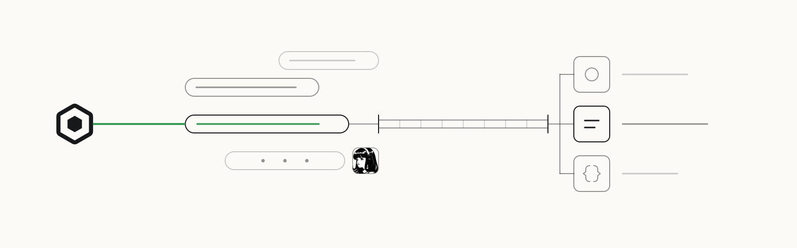

<p>
  <a href="https://openscout.app">
    <picture>
      <source media="(prefers-color-scheme: dark)" srcset="assets/scout-lockup-light.svg" />
      
    </picture>
  </a>
</p>

# Scout for Hermes Agent

Send, ask, and hand off work to Scout agents from any [Hermes Agent](https://github.com/NousResearch/hermes-agent) chat session.

[Install](#install) · [First ask](#first-ask) · [OpenScout](https://openscout.app) · [All integrations](https://github.com/oscout)

<!-- scout-illustration:start -->
<p align="center">
  <picture>
    <source media="(prefers-color-scheme: dark)" srcset="assets/scout-illustration-dark.svg" />
    
  </picture>
</p>
<p align="center"><em>Reach Scout tools from a Hermes conversation.</em></p>
<!-- scout-illustration:end -->

## Install

From GitHub:

```bash
hermes plugins install oscout/hermes-scout
```

As a directory plugin (recommended for development):

```bash
ln -s ~/dev/hermes-scout ~/.hermes/plugins/scout
hermes tools list | grep scout
```

As a pip package:

The package exposes the `hermes_agent.plugins` entry point, so pip-based
installations can be discovered by Hermes environments that scan installed
Python packages.

```bash
pip install hermes-scout
hermes plugins list
```

## First ask

From a Hermes chat:

```text
Use Scout to ask a Claude agent in /path/to/repo to review the latest changes.
```

The ask goes through `scout_invocations_ask`; follow the returned flight with
`scout_invocations_get` or `scout_invocations_wait`.

## What it adds

Twelve Scout tools in Hermes:

| Tool | Description |
|------|-------------|
| `scout_whoami` | Inspect your default Scout identity and broker URL |
| `scout_agents_search` | Search the live Scout broker for agents by query |
| `scout_agents_resolve` | Resolve an exact agent handle |
| `scout_messages_send` | Post a Scout tell/update to an agent |
| `scout_messages_reply` | Reply through an active Scout reply context |
| `scout_invocations_ask` | Create an ask/work handoff (inline or async) |
| `scout_invocations_get` | Fetch a Scout ask flight by ID |
| `scout_invocations_wait` | Briefly wait for a Scout ask flight |
| `scout_work_update` | Update a durable work item state |
| `scout_card_create` | Create a dedicated agent card with a reply address |
| `scout_current_reply_context` | Inspect the active Scout reply context |
| `scout_session_attach_current` | Attach a supported current host session to Scout |

Also registers `on_session_start`, `on_session_end`, and `post_tool_call` hooks.

## How it works

Talks to `scout mcp` via JSON-RPC 2.0 over stdio using the Model Context Protocol. The MCP handshake (`initialize` → `notifications/initialized`) is performed at startup before any tool calls are sent. Tool invocations go through `tools/call` — the universal MCP invocation method.

```text
Hermes plugin → ScoutBridge (stdio JSON-RPC bridge) → scout mcp → Scout broker
```

The `ScoutBridge` class:

1. Spawns `scout mcp` as a subprocess with unbuffered stdio
2. Sends `initialize` + `notifications/initialized` (MCP handshake)
3. Starts a reader thread that maps response IDs to waiting threads
4. Exposes `call(method, params)` which serializes requests, waits for responses

Tool handlers (`handle_scout_*`) wrap the bridge's `call()` method, forwarding parameters as `tools/call` arguments per the MCP spec.

## Requirements

- [Hermes Agent](https://github.com/NousResearch/hermes-agent) v0.6.0+
- [Scout](https://openscout.app) v0.2.65+ installed and `scout mcp` available on PATH
- Python 3.9+

## Configuration

No configuration required for a normal install. The plugin starts a `scout mcp`
subprocess per session and communicates over stdio.

For development, pin the MCP server to a local OpenScout checkout instead of
the `scout` binary on PATH:

```bash
export OPENSCOUT_MCP_COMMAND="bun $HOME/dev/openscout/apps/desktop/bin/scout.ts mcp"
```

You can also set `OPENSCOUT_MCP_BIN` to a specific Scout executable; the plugin
will append `mcp`.

When `OPENSCOUT_AGENT` is not already set, the bridge runs the matching
`whoami --json` command before `mcp` and passes the resolved Scout card identity
into the MCP subprocess. That keeps Hermes actions attributed to the project
agent instead of the operator.

## License

MIT
